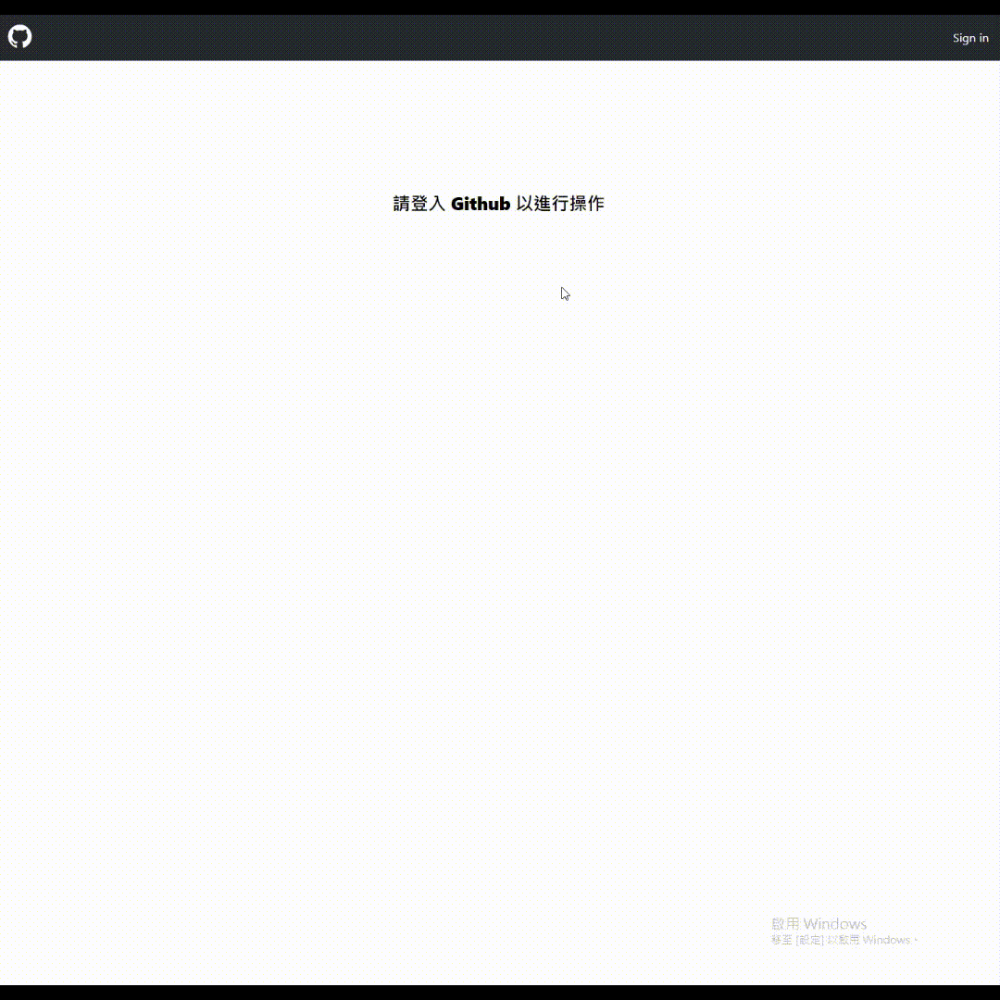
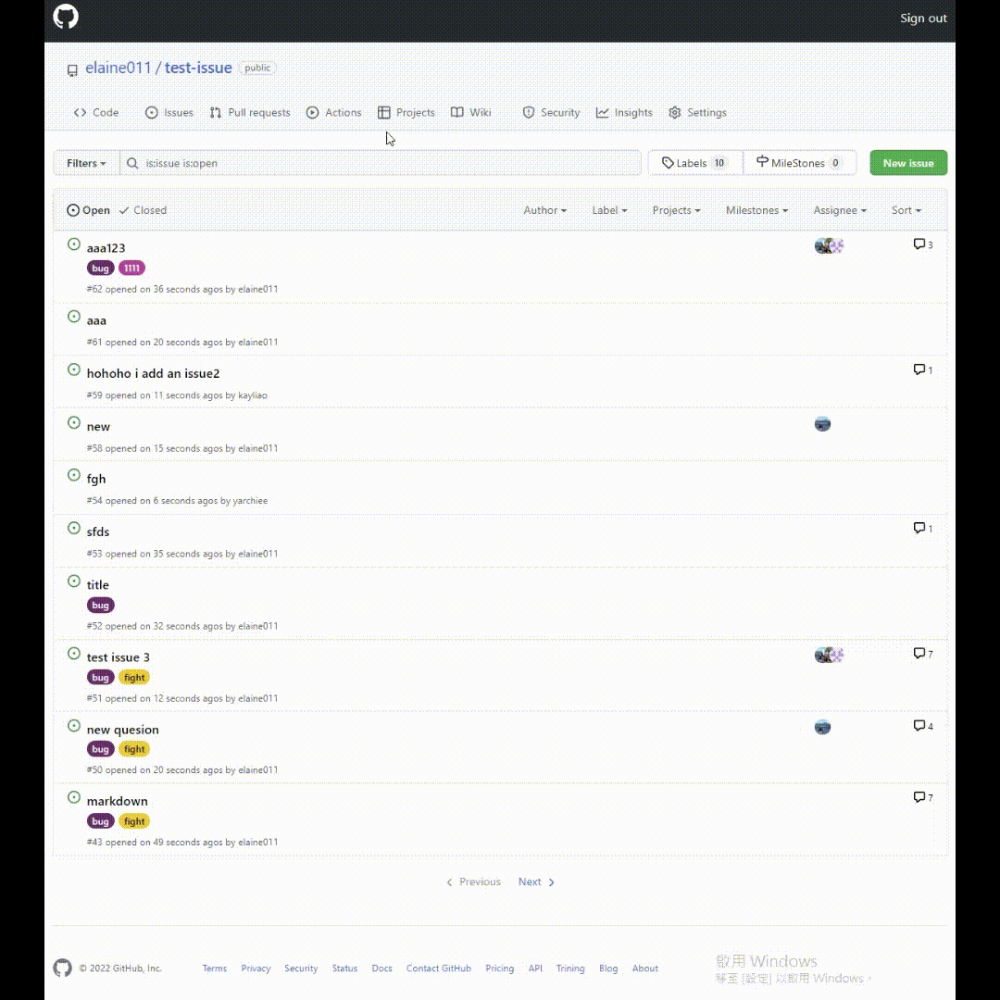
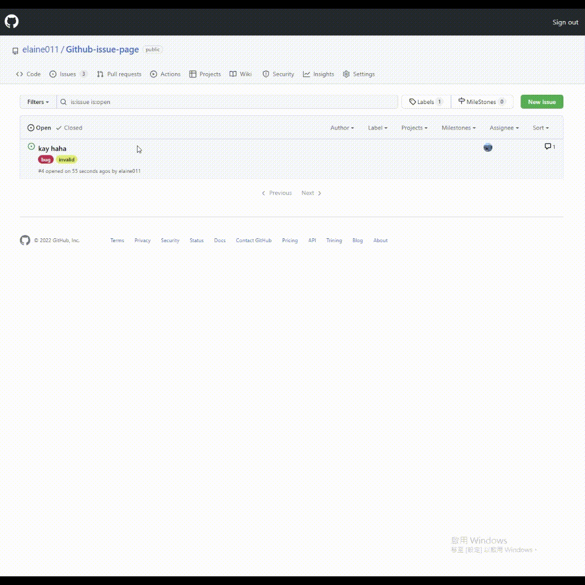
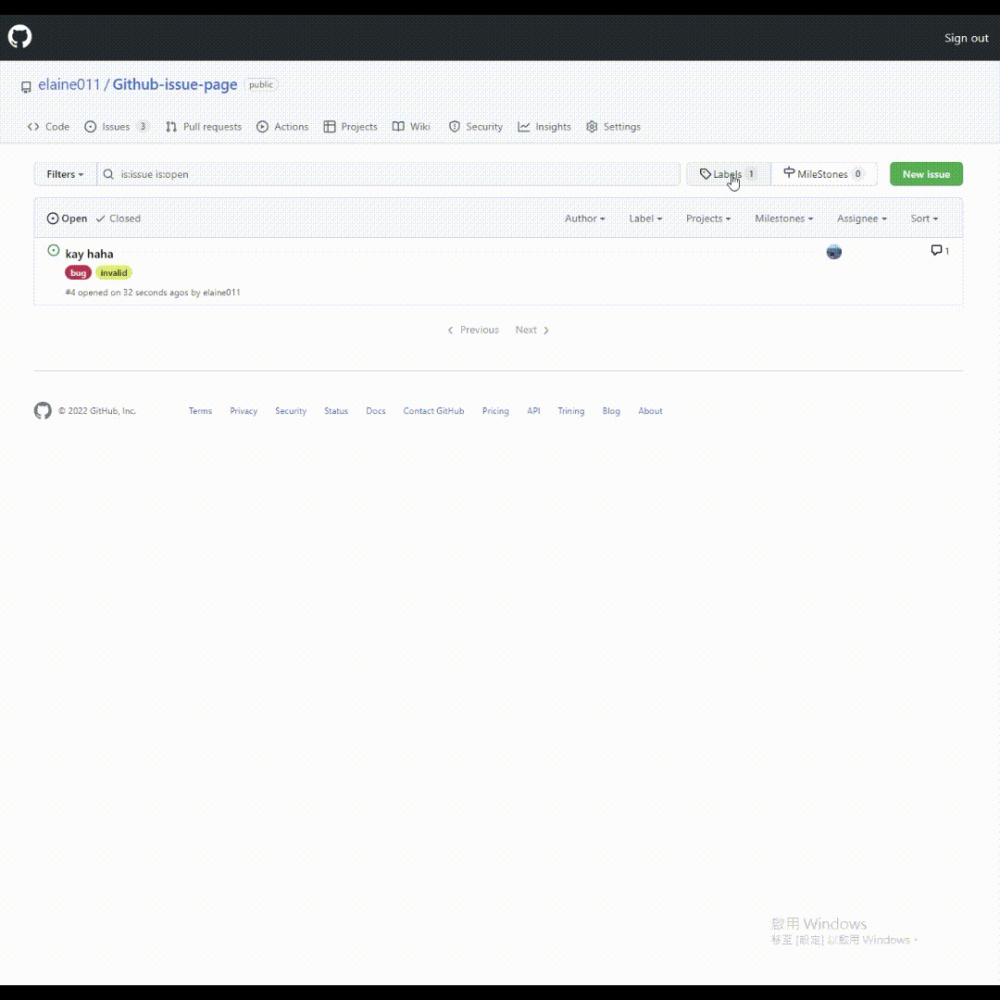
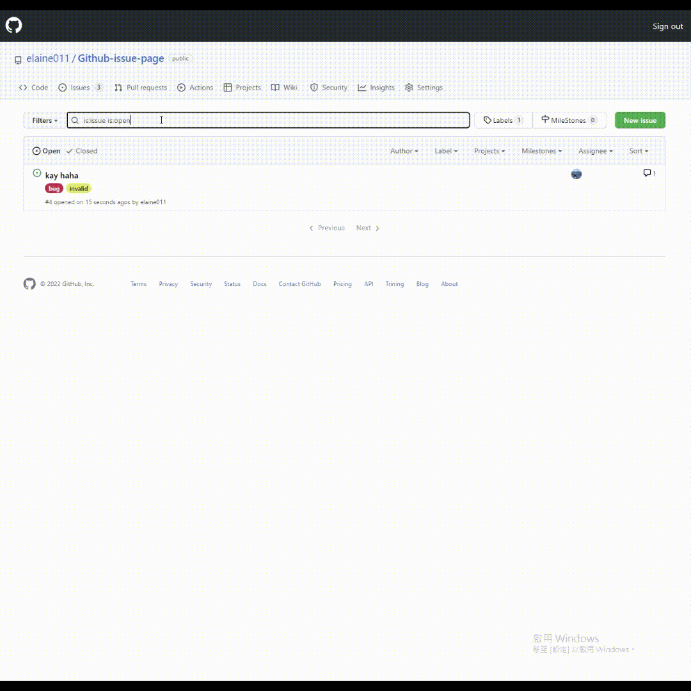

# Github Issues Mockup Website
<div align=center>
    
</div>

## 🌟 Overview
**This project is a mockup of GitHub's Issue and Label management pages. It includes features for user authentication, searching, filtering, and managing Issues and Labels.**


## ✨ Features
- **OAuth Login**: Authenticate users via GitHub OAuth using Supabase
- **Issues and Labels Management**: search, filter, create, edit, and delete Issues/labels
- **Markdown Support**: Use a rich markdown editor for Issue
- **Components Management**: Use [Storybook](https://githubstorybook.web.app/?path=/story/issue-assigneemenu--default) management reusable component


## 🛠️ Technologies Used
- **Frontend**: React、React Router v6、TypeScript
- **Styling**: Tailwind CSS、Styled Components
- **Markdown Editor**: Textarea-markdown-editor、Marked
- **Component Management**: Storybook
- **API Management**: Octokit
- **Authentication**: Supabase (GitHub OAuth integration)
- **Deployment**: Firebase


## 🧱 Repo Structure
```
├── src/
│   ├── components/          # Reusable React components
│   ├── pages/               # Page-level components for routes
│   ├── redux/               # State Management
│   ├── utils/               # Utility functions
│   │   ├── api.ts           # API logic and integrations
│   │   ├── type.ts          # Type integrations
│   │   ├── client.ts        # Client for Supabase
│   │   ├── firebase.ts      # Firebase config
│   │   ├── ...
│   ├── stories/             # Storybook components
│   ├── App.tsx              # Root component
│   ├── index.tsx            # Main entry file
├── .storybook/              # Storybook configuration
    ├── main.js
    └── preview.js
```


## 🎢 Route Stucture
```
/ (Root)
├── / (Repo)                 # Default homepage displaying the Repo page
├── /labels                  # Labels management page
├── /issues                  # Issues management page
├── /newissue                # Create a new issue page
├── /issuePage/:issueId      # Individual issue details page (dynamic route)
└── *                        # Fallback route 
```


## 🔥 Page Demo
### 💫 Login Page


### 💫 Issues Page


### 💫 Issue Page


### 💫 Label Page


### 💫 NewIssue Page


### 💫 RWD Page
